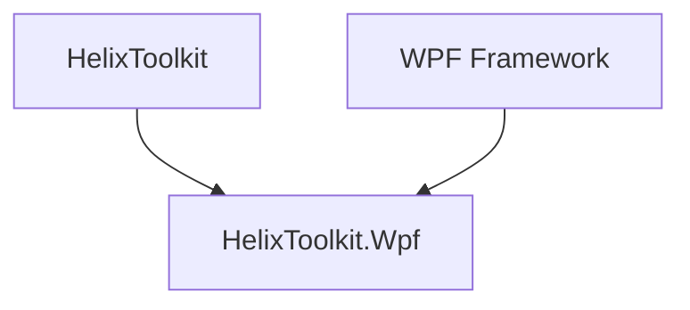
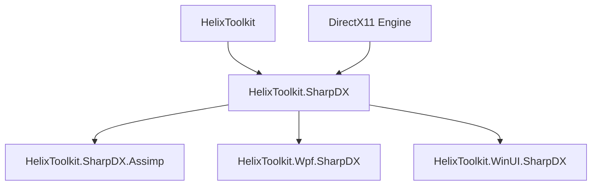

 

# Helix Toolkit

**Helix Toolkit is a collection of 3D components for .NET Framework.**

[**HelixToolkit.WPF:**](/Source/HelixToolkit.Wpf)
Adds variety of functionalities/models on the top of internal WPF 3D models (Media3D namespace).

[**HelixToolkit.SharpDX.WPF:**](/Source/HelixToolkit.Wpf.SharpDX)
Custom 3D Engine and XAML/MVVM compatible Scene Graphs based on [SharpDX](https://github.com/sharpdx/SharpDX)(DirectX 11) for WPF.

[**HelixToolkit.SharpDX.WinUI:**](/Source/HelixToolkit.WinUI.SharpDX)
Custom 3D Engine and XAML/MVVM compatible Scene Graphs based on [SharpDX](https://github.com/sharpdx/SharpDX)(DirectX 11) for WinUI.

[**HelixToolkit.SharpDX.Assimp:**](/Source/HelixToolkit.SharpDX.Assimp)
[Assimp.Net](https://bitbucket.org/Starnick/assimpnet/src/master/) 3D model importer/expoter support for HelixToolkit.SharpDX Components.

[**Examples:**](/Source/Examples)
Please download full source code to run examples.

Description         | Value
--------------------|-----------------------
Web page            | http://helix-toolkit.github.io/
Wiki                | https://github.com/helix-toolkit/helix-toolkit/wiki
Documentation       | http://helix-toolkit.readthedocs.io/
Chat                | https://gitter.im/helix-toolkit/helix-toolkit
Source repository   | http://github.com/helix-toolkit/helix-toolkit
Latest build        | http://ci.appveyor.com/project/holance/helix-toolkit
Issue tracker       | http://github.com/helix-toolkit/helix-toolkit/issues
NuGet packages      | http://www.nuget.org/packages?q=HelixToolkit
Nightly build       | https://www.myget.org/F/helixtoolkit-nightly
StackOverflow       | http://stackoverflow.com/questions/tagged/helix-3d-toolkit
Twitter             | https://twitter.com/hashtag/Helix3DToolkit

## Project Build

**Visual Studio 2022.**

## Notes

#### 1. Right-handed Cartesian coordinate system and row major matrix by default
HelixToolkit default is using right-handed Cartesian coordinate system, including Meshbuilder etc. To use left-handed Cartesian coordinate system (Camera.CreateLeftHandedSystem = true), user must manually correct the triangle winding order or IsFrontCounterClockwise in raster state description if using SharpDX. Matrices are row major by default.

#### 2. Performance [Topics](https://github.com/helix-toolkit/helix-toolkit/wiki/Tips-on-performance-optimization-(WPF.SharpDX-and-UWP)) for WPF.SharpDX and UWP.

#### 3. Following features are not supported currently on FeatureLevel 10 graphics card:
FXAA, Order Independant Transparent Rendering, Particle system, Tessellation.

#### 4. [Wiki](https://github.com/helix-toolkit/helix-toolkit/wiki) and useful [External Resources](https://github.com/helix-toolkit/helix-toolkit/wiki/External-References) on Computer Graphics.

## HelixToolkit Library Structure

### WPF Internal 3D Engine (DirectX9)

### HelixToolkit DirectX11 Engine

## Bug Report
Please use the following template to report bugs.

- Version: [Example: 2.20]
- Package: [Example: Helixtoolkit.Wpf]
- Issue: 
- Reproduce Steps:
- Sample Code:

## News
#### 2025-01-23
[v2.26.0](https://github.com/helix-toolkit/helix-toolkit/releases/tag/v2.26.0) releases are available on nuget. [Release Note](/CHANGELOG.md)

:bangbang: This is the final release of HelixToolkit v2. Moving forward, our focus will shift to the development of v3.

- [WPF](https://www.nuget.org/packages/HelixToolkit.Wpf/2.26.0)
- [Core.WPF](https://www.nuget.org/packages/HelixToolkit.Core.Wpf/2.26.0)
- [WPF.Input](https://www.nuget.org/packages/HelixToolkit.Wpf.Input/2.26.0)
- [WPF.SharpDX](https://www.nuget.org/packages/HelixToolkit.Wpf.SharpDX/2.26.0)
- [UWP](https://www.nuget.org/packages/HelixToolkit.UWP/2.26.0)
- [SharpDX.Core](https://www.nuget.org/packages/HelixToolkit.SharpDX.Core/2.26.0)
- [SharpDX.Core.Wpf](https://www.nuget.org/packages/HelixToolkit.SharpDX.Core.Wpf/2.26.0)
- [WinUI](https://www.nuget.org/packages/HelixToolkit.WinUI/2.26.0)
- [SharpDX.Assimp](https://www.nuget.org/packages/HelixToolkit.SharpDX.Assimp/2.26.0)

#### Changes (Please refer to [Release Note](https://github.com/helix-toolkit/helix-toolkit/blob/master/CHANGELOG.md) for details)

#### 2023-03-17
Nightly build myget feed link has been updated to: https://www.myget.org/F/helixtoolkit-nightly

