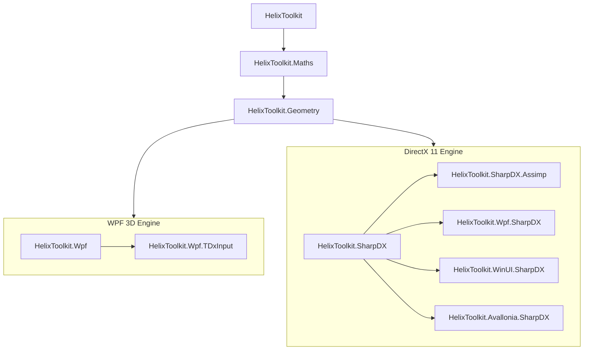

 

# Helix Toolkit

**Helix Toolkit is a collection of 3D components for .NET Framework.**

[**HelixToolkit:**](/Source/HelixToolkit)
Core components shares across different projects.

[**HelixToolkit.Maths:**](/Source/HelixToolkit.Maths)
Modified Math library carried over from SharpDX project to support `System.Numerics` library.

[**HelixToolkit.Geometry:**](/Source/HelixToolkit.Geometry)
Geometry builder library to support common shapes.

[**HelixToolkit.SharpDX:**](/Source/HelixToolkit.SharpDX)
Custom 3D Engine and Scene Graphs based on [SharpDX](https://github.com/sharpdx/SharpDX)(DirectX 11).

[**HelixToolkit.Avalonia.SharpDX:**](/Source/HelixToolkit.Avalonia.SharpDX)
XAML/MVVM compatible Scene Graphs for supporting AvaloniaUI based on `HelixToolkit.SharpDX`.

[**HelixToolkit.Wpf.SharpDX:**](/Source/HelixToolkit.Wpf.SharpDX)
XAML/MVVM compatible Scene Graphs for supporting WPF based on `HelixToolkit.SharpDX`.

[**HelixToolkit.SharpDX.Assimp:**](/Source/HelixToolkit.SharpDX.Assimp)
[SharpAssimp](https://github.com/JeremyAnsel/SharpAssimp) 3D model importer/expoter support for `HelixToolkit.SharpDX` Components.

[**HelixToolkit.WinUI.SharpDX:**](/Source/HelixToolkit.WinUI.SharpDX)
XAML/MVVM compatible Scene Graphs for supporting WinUI based on `HelixToolkit.SharpDX`.

[**HelixToolkit.Wpf:**](/Source/HelixToolkit.Wpf)
Adds variety of functionalities/models on the top of internal WPF 3D models (Media3D namespace).

[**Examples:**](/Source/Examples)
Please download full source code to run examples.

Description         | Value
--------------------|-----------------------
Web page            | http://helix-toolkit.github.io/
Wiki                | https://github.com/helix-toolkit/helix-toolkit/wiki
Documentation       | http://helix-toolkit.readthedocs.io/
Chat                | https://gitter.im/helix-toolkit/helix-toolkit
Source repository   | http://github.com/helix-toolkit/helix-toolkit
Latest build        | http://ci.appveyor.com/project/holance/helix-toolkit
Issue tracker       | http://github.com/helix-toolkit/helix-toolkit/issues
NuGet packages      | http://www.nuget.org/packages?q=HelixToolkit
Nightly build       | https://www.myget.org/F/helixtoolkit-nightly
StackOverflow       | http://stackoverflow.com/questions/tagged/helix-3d-toolkit
Twitter             | https://twitter.com/hashtag/Helix3DToolkit

## Project Build

**Visual Studio 2022.**

## Notes

#### 1. Right-handed Cartesian coordinate system and row major matrix by default
HelixToolkit default is using right-handed Cartesian coordinate system, including Meshbuilder etc. To use left-handed Cartesian coordinate system (Camera.CreateLeftHandedSystem = true), user must manually correct the triangle winding order or IsFrontCounterClockwise in raster state description if using SharpDX. Matrices are row major by default.

#### 2. Performance [Topics](https://github.com/helix-toolkit/helix-toolkit/wiki/Tips-on-performance-optimization-(WPF.SharpDX-and-UWP)) for WPF.SharpDX and UWP.

#### 3. Following features are not supported currently on FeatureLevel 10 graphics card:
FXAA, Order Independant Transparent Rendering, Particle system, Tessellation.

#### 4. [Wiki](https://github.com/helix-toolkit/helix-toolkit/wiki) and useful [External Resources](https://github.com/helix-toolkit/helix-toolkit/wiki/External-References) on Computer Graphics.

## HelixToolkit Package Dependencies

```mermaid
flowchart TD
 subgraph s1["DirectX 11 Engine"]
        n6["HelixToolkit.SharpDX"]
        n7["HelixToolkit.SharpDX.Assimp"]
        n8["HelixToolkit.Wpf.SharpDX"]
        n9["HelixToolkit.WinUI.SharpDX"]
        n10["HelixToolkit.Avallonia.SharpDX"]
  end
 subgraph s2["WPF 3D Engine"]
        n11["HelixToolkit.Wpf"]
        n12["HelixToolkit.Wpf.TDxInput"]
  end
    hx["HelixToolkit"] --> n1["HelixToolkit.Maths"]
    n1 --> n2["HelixToolkit.Geometry"]
    n6 --> n7 & n8 & n9 & n10
    n11 --> n12
    n2 --> s2
    n2 --> s1

    n2@{ shape: rect}
```

## Bug Report
Please use the following template to report bugs.

- Version: [Example: 2.20]
- Package: [Example: Helixtoolkit.Wpf]
- Issue: 
- Reproduce Steps:
- Sample Code:

## News
#### 2025-11-10
[v3.1.1](https://github.com/helix-toolkit/helix-toolkit/releases/tag/v3.1.1) releases are available on nuget. [Release Note](/CHANGELOG.md)

:bangbang: HelixToolkit v2 is in maintainance mode (Will only release new version on critical bug fixes). Moving forward, our focus will shift to the development of v3.

- [HelixToolkit.Maths](https://www.nuget.org/packages/HelixToolkit.Maths/3.1.1)
- [HelixToolkit.Geometry](https://www.nuget.org/packages/HelixToolkit.Geometry/3.1.1)
- [HelixToolkit.SharpDX](https://www.nuget.org/packages/HelixToolkit.SharpDX/3.1.1)
- [HelixToolkit.WPF.SharpDX](https://www.nuget.org/packages/HelixToolkit.Wpf.SharpDX/3.1.1)
- [HelixToolkit.WinUI.SharpDX](https://www.nuget.org/packages/HelixToolkit.WinUI.SharpDX/3.1.1)
- [HelixToolkit.Avalonia.SharpDX](https://www.nuget.org/packages/HelixToolkit.Avalonia.SharpDX/3.1.1)
- [HelixToolkit.SharpDX.Assimp](https://www.nuget.org/packages/HelixToolkit.SharpDX.Assimp/3.1.1)
- [HelixToolkit.WPF](https://www.nuget.org/packages/HelixToolkit.Wpf/3.1.1)
- [HelixToolkit.Wpf.TDxInput](https://www.nuget.org/packages/HelixToolkit.Wpf.TDxInput/3.1.1)
- 
#### Changes (Please refer to [Release Note](https://github.com/helix-toolkit/helix-toolkit/blob/master/CHANGELOG.md) for details)

#### 2023-03-17
Nightly build myget feed link has been updated to: https://www.myget.org/F/helixtoolkit-nightly

